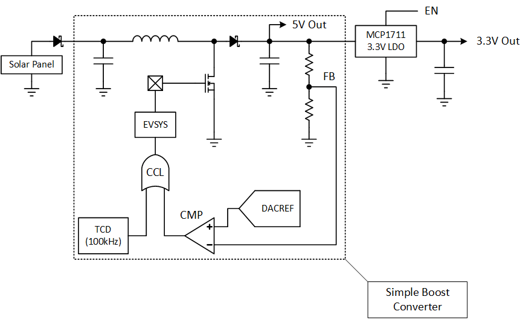

<!-- Please do not change this logo with link -->

# Batteryless UV Index (UVI) and Heat Index Monitor with AVR32DB32
This demo of the AVR&reg; DB family of MCUs implements a solar energy harvester to measure and display either the UV Index or the heat index. Multi-Voltage I/O (MVIO) is used to to communicate with 3.3V sensors, while the microcontroller runs at 5V.

## Software Used
- [MPLAB X IDE v6.0.0 or newer](https://www.microchip.com/en-us/tools-resources/develop/mplab-x-ide?utm_source=GitHub&utm_medium=TextLink&utm_campaign=MCU8_MMTCha_avrdb&utm_content=avr32db32-uv-monitor-github)
- [MPLAB XC8 v2.40.0 or newer](https://www.microchip.com/en-us/tools-resources/develop/mplab-xc-compilers?utm_source=GitHub&utm_medium=TextLink&utm_campaign=MCU8_MMTCha_avrdb&utm_content=avr32db32-uv-monitor-github)

## Hardware Used
- See BOM for a complete list

### Highlighted Hardware
- [AVR32DB32](https://www.microchip.com/en-us/product/AVR32DB32?utm_source=GitHub&utm_medium=TextLink&utm_campaign=MCU8_MMTCha_avrdb&utm_content=avr32db32-uv-monitor-github)
    - Microcontroller with Multi-Voltage I/O (MVIO)
- [MCP1711](https://www.microchip.com/en-us/product/MCP1711?utm_source=GitHub&utm_medium=TextLink&utm_campaign=MCU8_MMTCha_avrdb&utm_content=avr32db32-uv-monitor-github)
    - Low Dropout (LDO) Voltage Regulator
- [MCP9700A](https://www.microchip.com/en-us/product/MCP9700A?utm_source=GitHub&utm_medium=TextLink&utm_campaign=MCU8_MMTCha_avrdb&utm_content=avr32db32-uv-monitor-github)
    - Analog Output Temperature Sensor
- [LTR-390UV](https://optoelectronics.liteon.com/upload/download/DS86-2015-0004/LTR-390UV_Final_%20DS_V1%201.pdf)
    - Ambient Light and UV Sensor 
- [HTU21D(F)](https://www.te.com/commerce/DocumentDelivery/DDEController?Action=showdoc&DocId=Data+Sheet%7FHPC199_6%7FA6%7Fpdf%7FEnglish%7FENG_DS_HPC199_6_A6.pdf%7FCAT-HSC0004)
    - Temperature and Humidity Sensor

## Setup
| Pin(s) | Function
| ------ | ---------
| PA0:7  | LED Bar Graph Display Output
| PC0    | UART TX (3.3V)
| PC1    | I2C nINT (3.3V)
| PC2    | I2C SDA (3.3V)
| PC3    | I2C SCL (3.3V)
| PD1    | Debug GPIO (unused)
| PD2    | Boost Converter PWM Out
| PD3    | Boost Converter Analog Feedback
| PD4    | MCP9700A Analog Output (Temperature In)
| PD5    | MCP9700A Power Output
| PD6    | Start UV Measurement Button
| PD7    | Start Heat Index Measurement Button
| PF0    | (Debug Only) TCD-A PWM Output
| PF1    | LED Drive PWM
| PF2    | 3.3V Power Supply Enable
| PF6    | nRESET
| PF7    | UPDI

### Power Characteristics
Maximum Input Voltage from Solar Panel: 5.5V   

AVR DB Main Supply Voltage: 5V (see note)  
AVR DB MVIO Supply: 3.3V

Warning: **Do not exceed maximum input ratings. This circuit cannot regulate voltages above 5V. Damage to the microcontroller and the circuit may occur if exceeded.**

Note: *The 5V rail may vary depending on the amount of energy from the solar panel and the current load on the rail. The 3.3V rail is regulated by an LDO to ensure stable voltage levels.*

## Implementation
Warning: **This demo is for educational use only. Please obtain accurate UV Index and Heat Index information from a trusted source, such as the [National Oceanic and Atmospheric Administration (noaa.gov)](noaa.gov). Prolonged exposure to high temperatures can be life-threatening. Exposure to UV without appropriate precautions will also have health consequences.**

### Overview

### Solar Energy Harvester
To generate the 5V supply for this demo, a simple boost converter was built using the Core Independent Peripherals (CIPs) on the microcontroller. To run the boost, a 100 kHz PWM was created in the Timer/Counter D (TCD) peripheral on the device. The TCD output is then gated by the Analog Comparator (AC) via the logical AND inside of the Configurable Custom Logic (CCL). This configuration is shown below.

**Figure 1 - Simplified Power System**

### Display Scale

Heat Index and UVI share the same display, comprised of 8 LEDs in a row. The scale is copied below:

| LED # | Heat Index | UV Index
| ----- | ---------- | --------
| 1     | 80F- | 1-
| 2     | 85F | 2
| 3     | 90F | 3
| 4     | 95F | 4
| 5     | 100F | 5
| 6     | 105F | 6
| 7     | 110F | 7
| 8     | 115F+ | 8+

In the case of intermediate values (i.e.: 87F), the system rounds down.

### UV Index (UVI)

[Learn about the UV and UVI](https://www.epa.gov/sunsafety)

To measure the UVI, an LTR-390UV sensor was used. This sensor measures the UV intensity and digitalizes it.

#### Sensor Error

During development, we noticed that the LTR-390UV appears to be off by a factor of 2 when used with the settings recommended in the datasheet. The program corrects for this discrepency by right-shifting by 1.  

#### Testing

Since UVI is very time and positionally dependent, we used a commercial grade UV meter for reference against our results. The data from the LTR390-UV is not the exact UVI - it's specified &plusmn;1 UVI below values of 5, and &plusmn;20% when UVI is greater than 5. At UVI = 5, there is no specifiction, but a &plusmn;20% tolerance  = &plusmn;1 UVI.

More information can found in the [LTR-390UV datasheet](https://optoelectronics.liteon.com/upload/download/DS86-2015-0004/LTR-390UV_Final_%20DS_V1%201.pdf).

### Heat Index

[Learn about heat index](https://www.weather.gov/safety/heat-index)

#### Measuring the Heat Index

To measure the heat index, we used 2 sensors, an MCP9700A and an HTU21D(F) Temperature and Humidity sensor. The MCP9700A is an analog output temperature sensor while the HTU21D(F) measures humidity and temperature. For this project, we're using the MCP9700A for temperature and the humidity measurement from the HTU21D(F).

#### Conversion to Heat Index

Once temperature and humidity are known, the microcontroller can calculate the heat index by using the reference table provided by NOAA.

  

Graphic: [https://www.weather.gov/ama/heatindex](https://www.weather.gov/ama/heatindex)

Note: This graph is not subject to copyright protection.

The values in the table were encoded into memory, with blank positions being marked with 255 to indicate out-of-scale. If the temperature or humidity was out-of-scale, the system ignores humidity and plots temperature only.

#### Accuracy

Since the humidity sensor is temperature dependent, the values are not expected to be extremely accurate. Temperature correction for humidity was not applied. This is not an issue in this example, as the display only has 8 levels to show the heat index, and is not very precise.

**To reiterate, this demo is for educational use only. Please obtain heat index / UV Index from a trusted source.**

## Operating this Example

### Programming

To program the board, attach a UPDI programmer to the UPDI header, then apply power to the debug connector's +5V and GND point.

//TODO: Board Image Here!

After applying power, the board can be programmed as normal.  

### Using the System

Pressing the TEMP or UV button while the system is idle while start monitoring the heat index or UV Index appropriately. Monitoring will continue until the same button is pressed and held. When the display turns off, the button can be released.

## Summary

This application shows how to use a microcontroller as a small all-in-one solution for power management and data acquisition.
